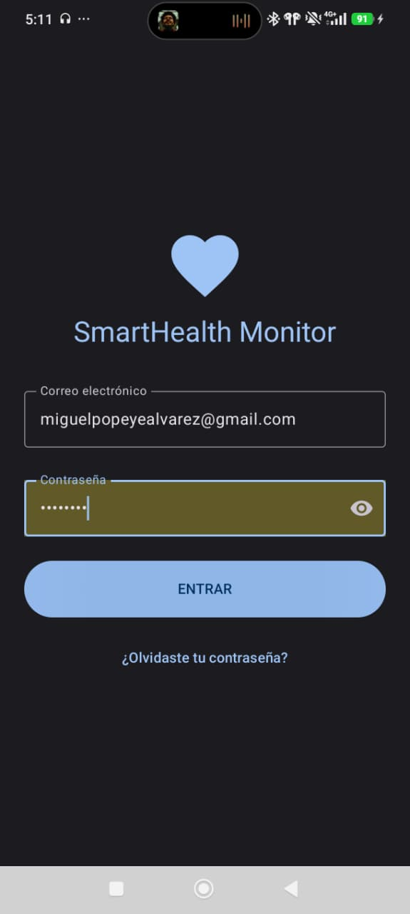
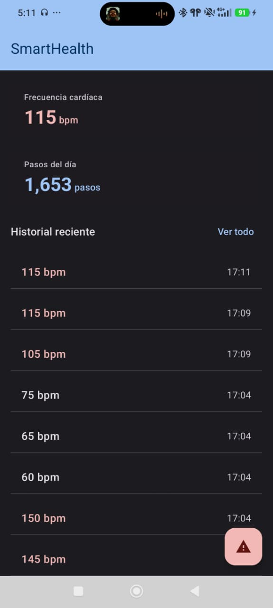
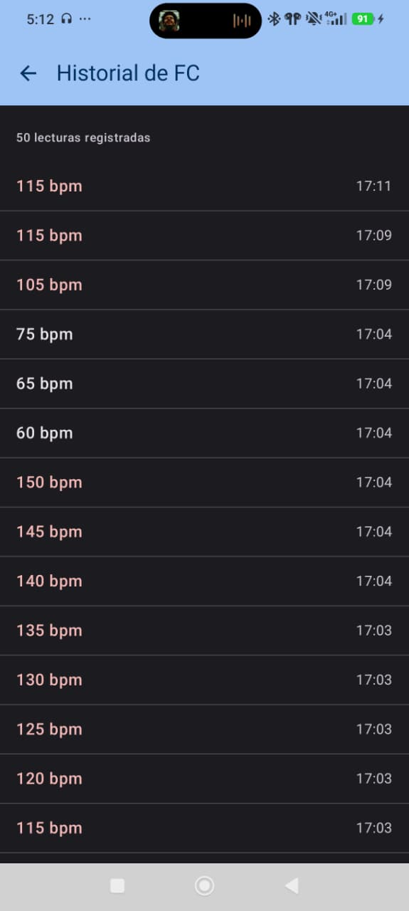
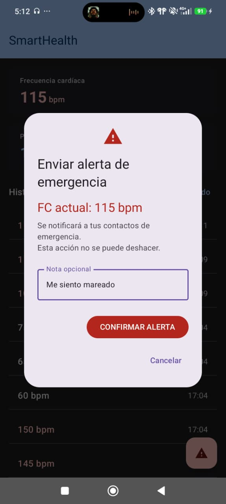
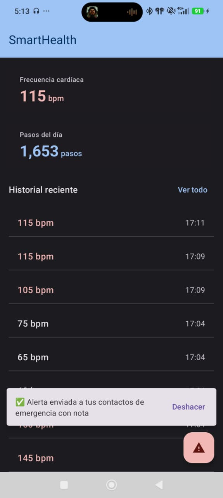
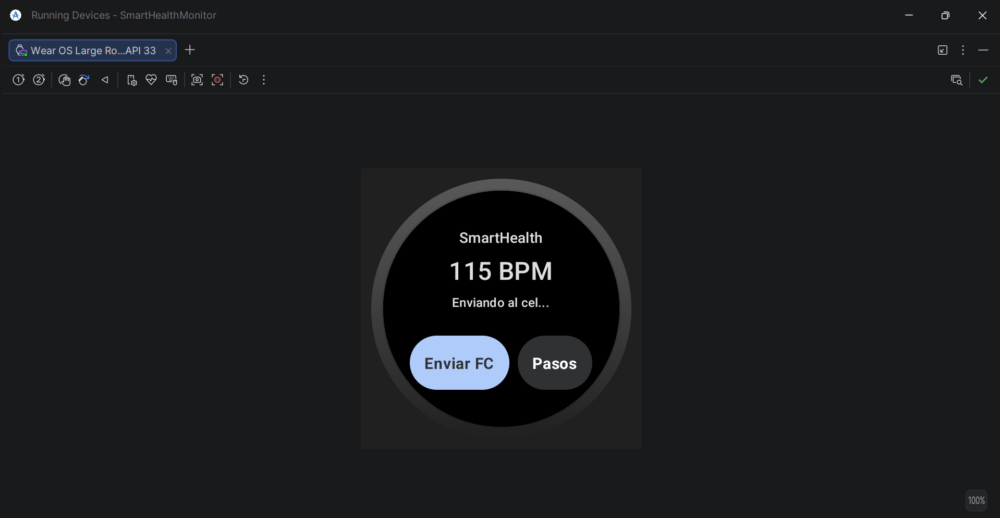

# SmartHealth Monitor

Aplicación Android de monitoreo de salud personal en tiempo real.
Desarrollada como proyecto integrador — UTNG 9° Cuatrimestre 2025.

## Stack tecnológico
| Tecnología | Uso |
|---|---|
| Kotlin + Jetpack Compose | UI declarativa con Material Design 3 |
| Wearable Data Layer API  | Comunicación reloj ↔ teléfono (BLE) |
| Health Services API     | Sensor FC real en background (Wear OS) |
| Room Database           | Historial persistente de lecturas FC |
| Jetpack Navigation      | NavHost entre 4 pantallas |
| GitHub + Conventional Commits | Control de versiones profesional |

## Pantallas
| Pantalla | Descripción |
|---|---|
| LoginScreen | Autenticación con validación y State |
| DashboardScreen | FC y Pasos en tiempo real del wearable |
| HistorialScreen | Lecturas persistidas en Room con Flow reactivo |
| AlertaScreen | AlertDialog MD3 + Snackbar de confirmación |

## Capturas de pantalla

## Autor
Miguel Angel Alvarez Ibarra — UTNG — Ing. en Desarrollo y Gestión de Software

## Unidad II — Wear OS
| Pantalla | Descripción |
|---|---|
| WearDashboardScreen | FC en tiempo real con ScalingLazyColumn y TimeText |
| WearHistorialScreen | Lista con Rotary Input (corona del reloj) |
| WearAlertaScreen    | Botones circulares de confirmación |
| SmartHealth WatchFace | Hora + FC en el WatchFace nativo |

- Watchface

- Wear Dashboard

